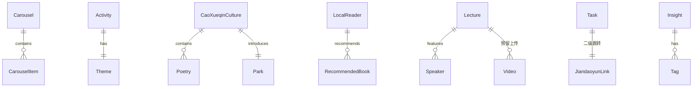

# 技术架构文档

## 1. 架构设计

```mermaid
flowchart TD
    subgraph "前端层"
    "React 18 + TypeScript"
    "TailwindCSS 3"
    "React Router DOM 6"
    end
    subgraph "外部服务层"
    "简道云表单（活动任务 ×6 / 心得展示）"
    "视频存储（专家讲座视频，预留接入点）"
    end
    subgraph "数据层"
    "本地 Mock 数据"
    "静态文化资源（曹雪芹诗文/名人资料）"
    "简道云跳转链接配置（预留）"
    end
    "前端层" --> "数据层"
    "前端层" --> "外部服务层"
```

纯前端展示项目。所有静态活动数据以 Mock 数据形式内置；外部接入点（简道云链接、视频上传）以配置化预留方式实现，便于后续接入。

## 2. 技术说明

- 前端：React@18 + TypeScript + TailwindCSS@3 + Vite
- 初始化工具：vite-init（react-ts 模板）
- 状态管理：组件内 useState（轮播索引、心得筛选标签等局部状态）
- 路由：react-router-dom@6
- 字体：思源宋体（Noto Serif SC）+ Ma Shan Zheng（书法体），通过 Google Fonts CDN 加载
- 图标：lucide-react
- 视频播放：原生 `<video>` 标签（H5 播放器）
- 简道云跳转：`<a>` 标签 `target="_blank"` 外链跳转，链接地址集中在配置文件中

## 3. 路由定义

| 路由 | 用途 |
|------|------|
| `/` | 首页：顶部通栏轮播 + 主标题 + 曹雪芹文化 + 本土名人 + 活动入口 |
| `/lectures` | 专家阅读指导讲座详情页（含视频上传窗口预留） |
| `/tasks` | 活动任务详情页（含 6 个简道云跳转窗口） |
| `/insights` | 心得展示墙详情页（简道云适配区预留） |
| `/admin/videos` | 管理员视频上传页（预留入口，简单本地状态实现） |

## 4. API 定义

无后端 API。视频上传与简道云数据接入均为预留接口点：

### 4.1 视频上传（预留）

```typescript
// 后续接入点：POST /api/videos
interface VideoUploadPayload {
  title: string;
  speaker: string;
  file: File;
  coverImage?: File;
}
```

### 4.2 简道云跳转链接配置

```typescript
// src/data/jiandaoyunLinks.ts
interface JiandaoyunLink {
  id: string;
  taskName: string;
  description: string;
  url: string; // 预留，初始为空字符串或占位
}
```

## 5. 服务器架构

无后端。视频上传使用前端本地 state 暂存（演示用），后续可接入真实后端。

## 6. 数据模型

### 6.1 数据模型定义



### 6.2 数据定义

数据通过 TypeScript interface 在 `src/data/types.ts` 中定义，具体数据放在：

- `src/data/carousel.ts`：三屏轮播内容
- `src/data/activity.ts`：活动主题、副标题、主办方
- `src/data/caoXueqin.ts`：曹雪芹公园、诗文、文化背景
- `src/data/localReaders.ts`：本土读书名人
- `src/data/lectures.ts`：专家讲座与嘉宾
- `src/data/videos.ts`：专家视频列表（预留上传入口，初始为空数组）
- `src/data/jiandaoyunLinks.ts`：6 个简道云任务跳转链接（预留 URL）
- `src/data/insights.ts`：读者心得墙（与简道云字段适配，初始为空占位）
